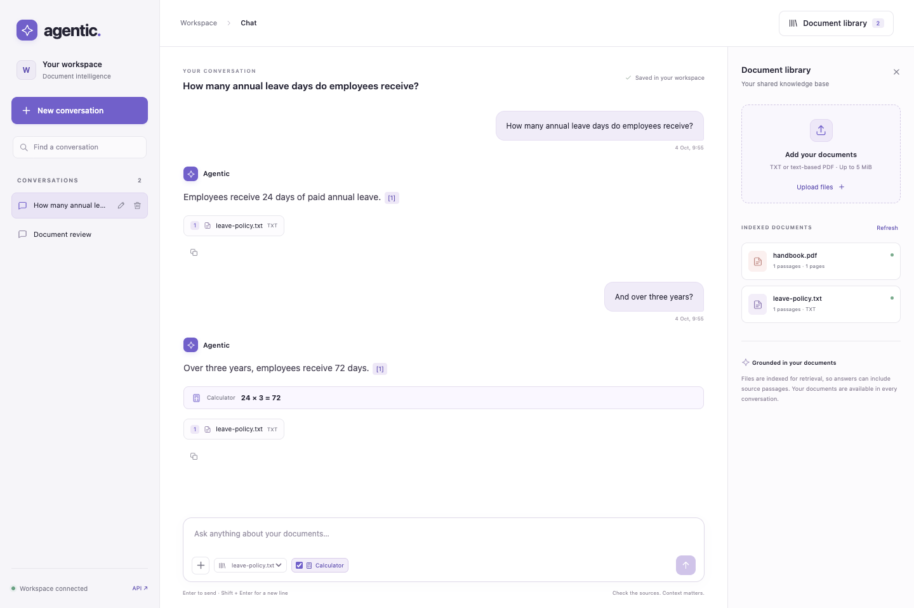
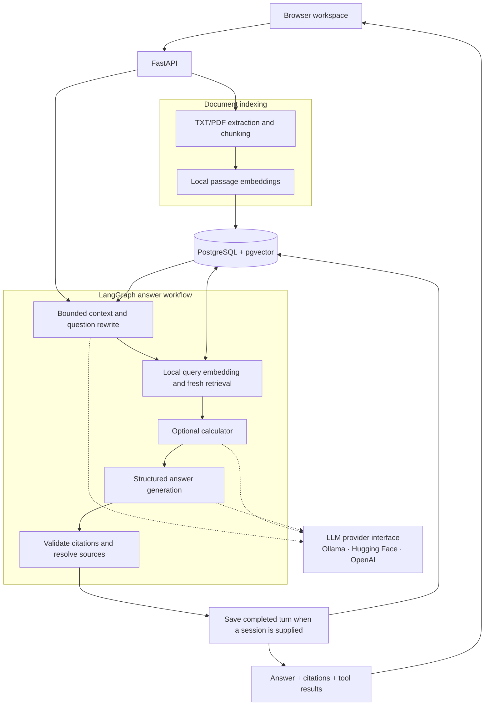
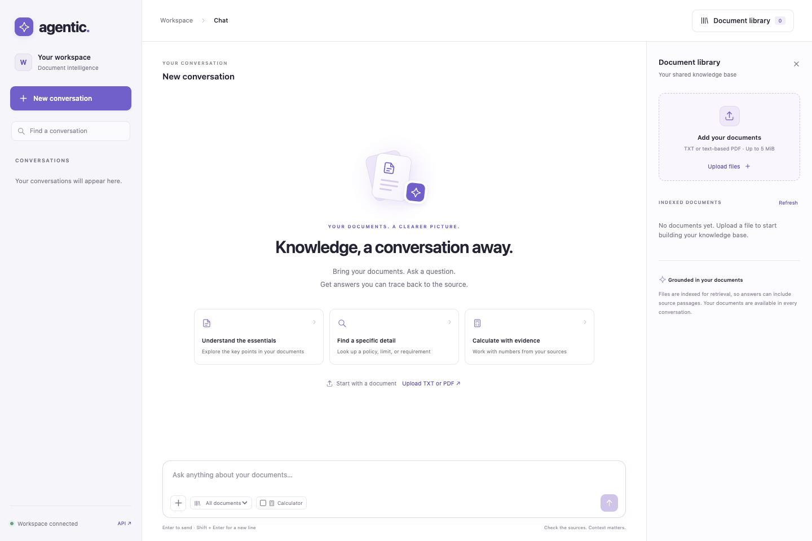
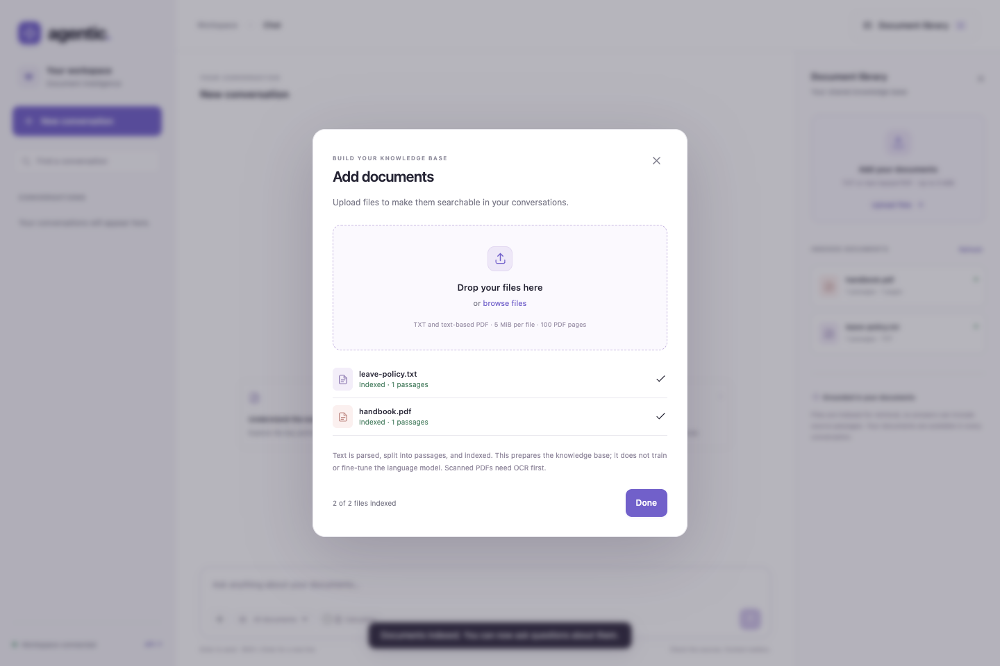
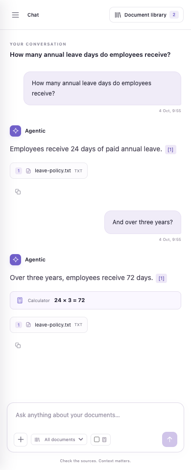

# Agentic RAG Assistant

**A document intelligence workspace with cited answers, tool-assisted reasoning, and persistent conversations.**

Upload policies, handbooks, or reference documents and ask questions in a responsive
chat interface. The assistant retrieves relevant passages, generates an answer
through your configured LLM, and attaches source references you can inspect.
Follow-up questions retain conversation context, while a bounded calculator can
perform arithmetic using retrieved evidence.

Built as an AI/backend portfolio project, the application brings together a
FastAPI API, a LangGraph workflow, local embeddings, PostgreSQL with pgvector,
and a browser workspace in one containerized system.

**Python 3.13 · FastAPI · LangGraph · FastEmbed · PostgreSQL · pgvector · Docker**

[Problem](#problem) · [Solution](#solution) · [Architecture](#architecture) ·
[Features](#features) · [Quick start](#quick-start) · [Demo](#demo-and-screenshots) ·
[API](#api-reference) · [Documentation](#documentation)



*Example: the assistant retrieves a fictional leave policy, answers with a source
citation, and uses the calculator to compute `24 × 3 = 72` for a follow-up question.*

## Problem

Useful answers are often buried across policies, handbooks, and reference PDFs.
Manual searching is slow, and a general-purpose chatbot may answer without access
to the right document or a source you can check. Follow-up questions and arithmetic
add another challenge: the answer needs context and verifiable calculations.

## Solution

The application supports a complete document-to-answer workflow:

1. **Upload** a UTF-8 TXT or text-based PDF document.
2. **Index** extracted text as overlapping passages with local embeddings.
3. **Ask** a question across the shared library or within a selected document.
4. **Inspect** source passages and any calculator results alongside the answer.
5. **Continue** the conversation or switch to another saved session.

Documents are indexed for retrieval; uploading does not train or fine-tune an LLM.
The current application is a **shared workspace for trusted local use**. Documents
are shared across conversations, while each session has its own persisted history.
Authentication and per-user access controls are extension points for deployment.

## Architecture



### Design decisions

- **Separate boundaries:** HTTP routers handle validation/status codes; services
  coordinate work; domain code handles parsing, evidence validation, and arithmetic;
  adapters own SQL and provider protocols.
- **Traceable evidence:** chunks retain stable IDs, page numbers, and character
  offsets. The server resolves citation metadata from retrieved passages instead
  of accepting invented source names from a model.
- **Bounded execution:** the graph permits at most one calculator call. Decimal
  arithmetic uses constrained operands and source references, without executing
  model-generated code.
- **Persistent, isolated conversation context:** PostgreSQL stores completed turns
  as structured snapshots. Follow-up rewriting uses at most three recent turns,
  then retrieves fresh evidence; historical answers do not become source evidence.
- **Atomic writes:** document reindexing is transactional. Conversation saves use
  revision checks; conflicting concurrent writes return 409 rather than losing a turn.
- **Explicit model preparation:** embedding downloads occur during setup. Requests
  load a prepared cache, keeping download failures outside normal request handling.
- **One application origin:** FastAPI serves packaged HTML/CSS/JavaScript and the
  API. Provider credentials stay on the server; no frontend build server is needed.

The [architecture guide](docs/architecture.md) details graph branches, persistence,
provider contracts, and the boundaries of citation validation.

## Features

| Capability | Implementation |
| --- | --- |
| Document ingestion | TXT/PDF validation, text extraction, overlapping chunks, and source page/character offsets |
| Local embeddings | CPU inference with `BAAI/bge-small-en-v1.5`; explicit model preparation and offline cache loading during requests |
| Semantic retrieval | PostgreSQL/pgvector exact cosine search with document and minimum-score filters |
| Cited answers | Structured model output, source-ID validation, and server-resolved filename, page, and passage metadata |
| Agent workflow | LangGraph nodes for retrieval, optional tool selection, generation, and response validation |
| Calculator tool | One optional add/subtract/multiply/divide call, constrained arguments, and deterministic decimal arithmetic |
| Conversation memory | Follow-up question rewriting from bounded recent history followed by fresh retrieval |
| Saved sessions | PostgreSQL persistence, automatic titles, rename/delete, session search in the UI, and paginated history |
| Provider independence | Configurable Ollama, Hugging Face, or OpenAI adapters behind a common interface |
| Browser workspace | Responsive chat, document library, upload progress, source inspection, and calculator controls |
| Operational checks | Liveness, local-dependency readiness, request IDs, safe errors, and JSON request diagnostics |
| Delivery and verification | Constrained dependencies, unit/API/database/browser checks, Docker, and a GitHub Actions workflow |

## Quick start

### Prerequisites

- Docker with Compose v2.
- A working LLM: local Ollama or a configured Hugging Face/OpenAI account.
- Network access for the first embedding-model download. A prepared cache is
  reused on later starts.

### 1. Configure the environment

From the repository root, create `.env` **only if it does not already exist**:

```sh
cp .env.example .env
```

The default configuration uses local Ollama:

```dotenv
LLM_PROVIDER=ollama
LLM_MODEL=qwen2.5:7b
```

Start Ollama on the host and prepare that model:

```sh
ollama pull qwen2.5:7b
```

If the Ollama service is not already running, start it with `ollama serve` in
another terminal. The selected generation model must fit your machine's available
memory. Ollama setup is separate from the application's local embedding model.

To use a remote LLM, update both `LLM_PROVIDER` and `LLM_MODEL` and provide its
credential before starting the application. See [provider configuration](#llm-provider-configuration).

### 2. Start the application

```sh
docker compose up --build -d --wait api
```

Compose waits for PostgreSQL, initializes the schema, prepares the embedding
cache, and starts the API after those jobs succeed. Database and embedding data
use separate persistent volumes. The application runs as a non-root user with a
read-only root filesystem.

| Interface | Address |
| --- | --- |
| Browser workspace | <http://127.0.0.1:8000/> |
| Interactive API documentation | <http://127.0.0.1:8000/docs> |
| Liveness | <http://127.0.0.1:8000/health> |
| Readiness | <http://127.0.0.1:8000/ready> |

On networks that require a private HTTPS CA, configure `TLS_CA_BUNDLE` as described
in the [operations guide](docs/operations.md#networks-with-a-private-https-ca) and use:

```sh
docker compose -f compose.yaml -f compose.ca.yaml up --build -d --wait api
```

Keep the same override files in later Compose commands. TLS verification remains
enabled. An existing host model cache can also be
[imported into Docker](docs/operations.md#import-a-prepared-host-cache).

### 3. Try a document conversation

1. Upload [`examples/leave-policy.txt`](examples/leave-policy.txt) through the document library.
2. Ask **“How many annual leave days do employees receive?”**
3. Open a citation to inspect the supporting passage.
4. Enable **Calculator**, then ask **“And over three years at that annual rate?”**
5. Create a second conversation, switch back, and refresh to see saved history.

The sample policy specifies 24 annual leave days. A model may choose the calculator
for the follow-up and compute 72 days. Wording and tool selection depend on the
configured model; enabling tools allows a call rather than forcing one.

For development outside Docker, use the [Python environment setup](docs/development.md#host-setup).
The project currently requires Python 3.13; the dependency set was verified with
Python 3.13.7 on macOS ARM64 and in the Linux ARM64 container.

## Demo and screenshots

These screenshots show the actual browser application, API, LangGraph workflow,
and PostgreSQL storage. The capture harness uses deterministic embedding and LLM
adapters so the demo is reproducible. They demonstrate application behavior;
live-model answer quality requires separate evaluation. All sample documents are
fictional.

### Workspace and document library

The desktop workspace places conversations, the chat composer, and the shared
knowledge library in one interface. Users can start another conversation or
upload a document directly from the workspace.



### TXT and PDF upload

The upload dialog accepts multiple files and tracks each file through indexing.
Successfully indexed documents appear in the library and become available to
subsequent questions.



### Cited answers, calculator results, and saved conversations

The opening screenshot shows two saved sessions, a document-scoped conversation,
source cards, and a calculator result. Source markers/cards open the retrieved
passages, letting users inspect the evidence behind an answer. Completed turns,
including citations and tool results, remain available after refresh.

### Mobile chat

The layout adapts to smaller screens with a conversation drawer and document
library controls. Answers, source cards, and calculator results remain accessible
in the mobile conversation view.



See the [demo walkthrough](docs/demo.md) for a presentation script and instructions
for reproducing the screenshots.

## LLM provider configuration

The graph depends on a common provider interface. Adapter selection happens in a
factory, so changing providers does not change retrieval code or require document
reindexing. Embeddings continue to run locally for every LLM choice.

| Provider | `LLM_PROVIDER` | `LLM_MODEL` | Credential |
| --- | --- | --- | --- |
| Ollama, local default | `ollama` | `qwen2.5:7b` | None |
| Hugging Face, remote | `huggingface` | Your supported model/provider route | `HF_TOKEN` |
| OpenAI, remote | `openai` | Your supported model ID | `OPENAI_API_KEY` |

A Hugging Face configuration has this shape; replace the model placeholder with
a route supported by your account:

```dotenv
LLM_PROVIDER=huggingface
LLM_MODEL=your-model-and-provider-route
HF_TOKEN=your-token
```

Remote providers require an explicit model and valid credentials. The selected
route must support structured output and native tool calling for calculator
requests. Hosted open-weight models can still incur inference charges; access,
quotas, and pricing belong to the provider account. There are no automatic
provider retries or fallbacks.

Containers reach host Ollama through `host.docker.internal:11434`; host Python
uses `127.0.0.1:11434`. Linux host binding may require an explicit override. After
changing configuration, recreate the API container or restart the host process.
Use the same Compose override files that were used at startup.

Keep credentials in the ignored `.env`. Only the question, selected passages,
and bounded conversation text needed for follow-ups are sent to the LLM.
Raw uploads are not retained; extracted text and embeddings remain in PostgreSQL.

See [.env.example](.env.example) and the full
[configuration reference](docs/operations.md#configuration).

## API reference

The browser and external clients use the same HTTP API. FastAPI exposes request
and response schemas at `/docs`.

| Method | Endpoint | Purpose |
| --- | --- | --- |
| `GET` | `/` | Browser workspace |
| `GET` | `/health` | Process liveness; returns `{"status":"ok"}` |
| `GET` | `/ready` | PostgreSQL schema and cached-embedding readiness |
| `POST` | `/documents/ingest` | Parse/chunk preview without persistence |
| `POST` | `/documents/index` | Parse, embed, and persist a document |
| `GET` | `/documents` | Paginated shared document library |
| `POST` | `/search` | Retrieve passages without answer generation |
| `POST` | `/ask` | Generate an answer with citations and optional tools/history |
| `POST` | `/conversations` | Create a saved conversation |
| `GET` | `/conversations` | List saved conversations |
| `GET` | `/conversations/{id}` | Load paginated conversation history |
| `PATCH` | `/conversations/{id}` | Rename a conversation |
| `DELETE` | `/conversations/{id}` | Delete a conversation and its turns |

### Index a document and ask a question

```sh
curl --fail-with-body http://127.0.0.1:8000/documents/index \
  -F 'file=@examples/leave-policy.txt;type=text/plain'

curl --fail-with-body http://127.0.0.1:8000/ask \
  -H 'Content-Type: application/json' \
  -d '{"question":"How many annual leave days do employees receive?","top_k":2}'
```

### Use a saved conversation

Create a session:

```sh
curl --fail-with-body -X POST http://127.0.0.1:8000/conversations
```

Copy its returned `conversation_id` into the request below, replacing the UUID
placeholder. Send the initial question before a contextual follow-up.

```json
{
  "question": "How many annual leave days do employees receive?",
  "conversation_id": "replace-with-created-conversation-uuid",
  "top_k": 2,
  "use_tools": true
}
```

Send **“And over three years at that annual rate?”** with the same ID to use the
session's context. Omitting `conversation_id` makes `/ask` stateless. Optional
`document_id` and `min_score` fields control retrieval; filters and tool settings
must be supplied on each request.

Answers return `question`, `answer`, `answered`, `citations`, `tool_results`, and
`conversation_id`. Citations include the retrieved chunk and its source metadata;
tool results include the operation, operands, computed value, and supporting source
IDs. When retrieval yields no passages, the workflow skips generation and returns
an insufficient-evidence response. With retrieved passages, the model can also
report insufficient evidence.

## Reliability and verification

Request middleware generates an `X-Request-ID`, bounds request bodies, and records
JSON diagnostics without logging document text, questions, credentials, or raw
upstream exceptions. Expected failures use explicit HTTP statuses, including
409 for conversation conflicts, 502 for invalid model output, 503 for unavailable
dependencies, and 504 for provider timeouts.

`/health` checks liveness. `/ready` exercises PostgreSQL schema compatibility and
cached embeddings; it does not call an LLM or verify remote inference access.
A ready API still needs a functioning configured provider to generate answers.

Install the development dependencies and run the ordinary suite:

```sh
python -m pip install -c requirements.lock -e '.[dev]'
python -m pytest -q
```

| Verification layer | What it checks |
| --- | --- |
| Unit and HTTP tests | Parsing/limits, vector validation, citations, arithmetic, provider protocols, graph routing, safe errors, and readiness |
| PostgreSQL integration | Retrieval filters, atomic indexing, saved history, revision conflicts, pagination, and migration preservation |
| Browser workflows | TXT/PDF upload, sessions, refresh persistence, citations, calculator results, failures, safe text rendering, and mobile controls |
| Container workflow | Real local embeddings and SQL, provider HTTP protocol with a deterministic fixture, and history surviving API container recreation |
| GitHub Actions | Full tests, browser workflows, wheel packaging, Compose validation, container build, and non-root runtime verification |

Database checks require a dedicated database ending in `_test`; they are skipped
without `TEST_DATABASE_URL`. Browser/container fixtures avoid paid inference and
do not measure live-model accuracy. CI is defined in
[`.github/workflows/ci.yml`](.github/workflows/ci.yml); a hosted pass should be
verified in GitHub Actions after publication.

The [development guide](docs/development.md) contains full setup, integration,
browser, container, and dependency-update commands.

## Scope and limitations

| Area | Current boundary |
| --- | --- |
| Access control | Shared trusted-local workspace; no authentication or per-user document/session ownership |
| Uploads | UTF-8 TXT and text-based PDF; 5 MiB, 100 PDF pages, and 500,000 extracted characters per document |
| Parsing | No OCR or table-aware extraction; fixed 1,000-character chunks with 200-character overlap |
| Retrieval | Exact cosine search; no approximate index, reranker, or measured retrieval-quality benchmark |
| Evidence | Source-ID validation checks references; it does not prove that every generated statement follows from the evidence |
| Tools | One bounded calculator call; no arbitrary code execution or external API tools |
| Memory | Bounded recent-turn context; no LangGraph checkpoints, long-term summaries, or graph resume |
| Runtime | No streaming, background ingestion queue, or multi-user authorization layer |

Questions accept up to 2,000 trimmed characters. `/ask` retrieves at most five
passages; `/search` supports up to twenty. Embedding inputs exceeding the model's
512-token limit are rejected rather than silently truncated. These limits make
the current behavior explicit and identify extension points for larger deployments.

## Project structure

```text
.
├── src/agentic_rag_assistant/
│   ├── main.py, web.py, static/          # FastAPI app and browser workspace
│   ├── documents.py, search.py          # Ingestion and retrieval HTTP routes
│   ├── answers.py, agent.py             # Answer API and LangGraph workflow
│   ├── ingestion.py, chunking.py        # Parsing and source-preserving passages
│   ├── embeddings.py, retrieval.py      # Local embeddings and retrieval service
│   ├── answering.py, tools.py, memory.py # Evidence, calculator, and bounded context
│   ├── llm/                            # Ollama, Hugging Face, and OpenAI adapters
│   ├── conversations.py                # Session management routes
│   ├── conversation_service.py         # Conversation orchestration
│   ├── conversation_store.py           # PostgreSQL history and revision checks
│   ├── database.py, vector_store.py     # Schema initialization and vector storage
│   ├── operations.py, readiness.py      # Diagnostics, body limits, and readiness
│   └── settings.py, models.py, schema.sql
├── tests/                              # Unit, API, SQL, browser, and container checks
├── docs/                               # Guides, demo, and screenshots
├── examples/, sample-docs/              # Fictional documents
├── pyproject.toml, requirements.lock    # Package metadata and dependency constraints
├── Dockerfile, compose*.yaml            # Container runtime and startup jobs
└── .github/workflows/ci.yml             # Automated verification
```

## Documentation

| Guide | Contents |
| --- | --- |
| [Architecture](docs/architecture.md) | Document lifecycle, graph flow, provider boundaries, persistence, and design tradeoffs |
| [Development](docs/development.md) | Host setup, dependency management, tests, browser checks, and package verification |
| [Operations](docs/operations.md) | Docker startup, configuration, readiness, TLS trust, storage, and troubleshooting |
| [Demo](docs/demo.md) | Five-minute walkthrough, screenshots, and reproducible capture instructions |
| [Technical owner handbook](docs/technical-owner-handbook.docx) | Detailed implementation walkthroughs, architectural tradeoffs, glossary, and 50 technical reviewer questions with answers; download as a Word document |
| [Learning notes](docs/learning-notes.md) | Incremental project history and component explanations |

## License

Released under the [MIT License](LICENSE). Included policy and handbook documents
are fictional examples for demonstration.
