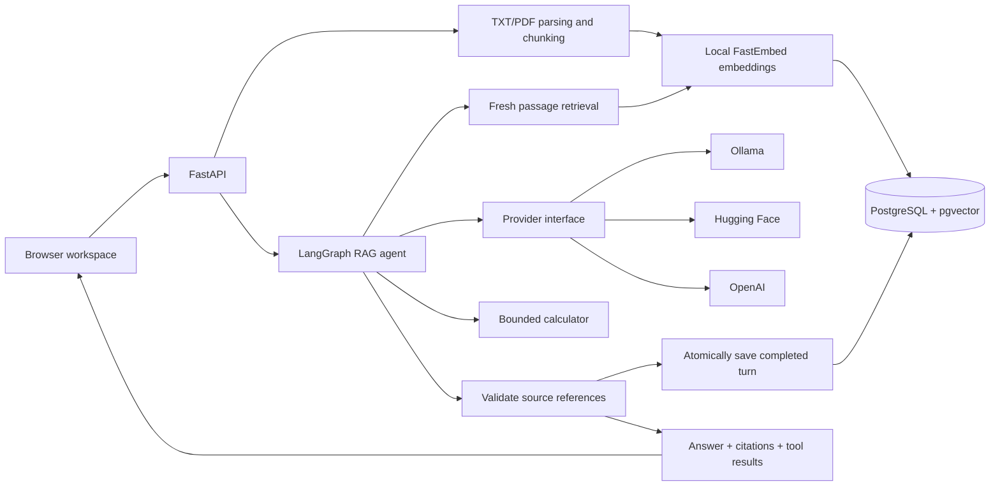

# Agentic RAG Assistant

A document-question-answering workspace with cited evidence, bounded tool calling,
and conversations persisted in PostgreSQL. Upload a policy or handbook, ask a
question, inspect its source passage, and return to the conversation later.

**Python 3.13 · FastAPI · LangGraph · FastEmbed · PostgreSQL/pgvector · Docker**


*The screenshots use the real UI, API, LangGraph, and PostgreSQL with deterministic
test embedding/LLM adapters. They illustrate functionality, not model-quality
benchmarks. [Demo walkthrough and more screenshots](docs/demo.md).*

## What it does

- Index UTF-8 TXT and text-based PDF files with page/character traceability and
  idempotent uploads. Embeddings run locally on CPU.
- Retrieve relevant passages with pgvector cosine search and generate structured
  answers through **Ollama** (local default), **Hugging Face**, or **OpenAI**.
- Validate cited source IDs and attach authoritative filename, page, and passage
  metadata. Abstain when the model reports insufficient evidence.
- Let the LangGraph workflow choose one calculator call using retrieved evidence;
  display the server-computed result alongside the answer.
- Save multiple conversations, resolve bounded follow-up context, rename/delete
  sessions, and load older messages. Saved turns include citations and tool results.
- Run one same-origin FastAPI server for the responsive browser workspace and API.
  No frontend build server, CDN, or browser-held provider credentials.
- Return safe errors with request IDs, emit JSON request diagnostics, and distinguish
  lightweight liveness from local-dependency readiness.

This is a complete portfolio implementation of the planned ten milestones, built
with production-oriented boundaries and verification. It is currently a **shared
workspace for trusted local use**: authentication and per-user authorization are
not implemented. [Scope and limitations](docs/architecture.md#scope-and-limitations).

## Quick start with Docker

Prerequisites: Docker with Compose v2, network access for the first embedding-model
download, and a configured LLM. Preserve your existing `.env` if it already exists.

```sh
# First setup only:
cp .env.example .env

# Edit .env for your chosen LLM, then:
docker compose up --build -d --wait api
```

Open **[the workspace](http://127.0.0.1:8000/)** or
**[API documentation](http://127.0.0.1:8000/docs)**.

Compose waits for PostgreSQL, runs the additive schema initialization and model
preparation jobs, then starts the API. PostgreSQL and embedding files use separate
named volumes; existing development data stays in the original PostgreSQL volume.
The application runs as a non-root user with a read-only root filesystem.

The default LLM is local Ollama. Start it on the host and prepare the selected model:

```sh
ollama pull qwen2.5:7b
```

If the Ollama desktop service is not running, use `ollama serve`. Containers use
`host.docker.internal:11434`; host Python uses `127.0.0.1:11434`. Linux host binding
can need an explicit override. Local model generation requires sufficient memory
for the selected model. Ollama installation/model downloads are separate from
the lightweight local embedding model.

If your network supplies a private HTTPS CA, use the
[trusted CA-bundle override](docs/operations.md#networks-with-a-private-https-ca),
or [import your prepared host embedding cache](docs/operations.md#import-a-prepared-host-cache).
TLS verification stays enabled. First-run download failures prevent API startup;
ordinary requests and warm model-preparation jobs do not download models.

To keep running the API directly in your existing virtual environment, follow
the [host development setup](docs/development.md#host-setup). Plain
`docker compose up -d postgres` still starts only the database.

## Configure the LLM

Edit `.env`, then recreate the Docker API (`docker compose up -d --force-recreate api`)
or restart the host process. Provider selection belongs in the adapter factory,
not the RAG workflow. Changing the LLM does not require document reindexing.

| Provider | Configuration | Credential |
| --- | --- | --- |
| Ollama, local default | `LLM_PROVIDER=ollama`, `LLM_MODEL=qwen2.5:7b` | None |
| Hugging Face, remote | `LLM_PROVIDER=huggingface`, `LLM_MODEL=Qwen/Qwen3-32B:deepinfra` | `HF_TOKEN` with inference-provider permission |
| OpenAI, remote | `LLM_PROVIDER=openai`, `LLM_MODEL=<supported-model>` | `OPENAI_API_KEY` |

Remote providers need both an explicit model and a valid credential; a token alone
does not select a provider. The model/provider route must support structured output
and native tool calling for calculator requests. Availability, access, and billing
depend on your provider account. Hosted open-weight models can still incur
inference charges. The app does not automatically retry or change providers.

Only the question, bounded follow-up question/answer text when needed, and retrieved
passages are sent to the configured LLM. Documents are indexed locally, not used
to train or fine-tune the LLM. Keep keys in the ignored `.env`; image builds exclude
it, and API responses/logs do not expose it.

See [.env.example](.env.example) and the [configuration reference](docs/operations.md#configuration).

## Architecture



Routes handle HTTP; services coordinate work; domain code handles parsing,
arithmetic, and evidence validation; adapters own SQL and provider protocols.
Only completed turns are persisted. Each LangGraph invocation has fresh transient
state, and conflicting concurrent saves return 409 instead of losing updates.

[Detailed request flow and design decisions](docs/architecture.md) ·
[Incremental learning notes](docs/learning-notes.md)

## Use the API

```sh
curl --fail-with-body http://127.0.0.1:8000/documents/index \
  -F 'file=@examples/leave-policy.txt;type=text/plain'

curl --fail-with-body http://127.0.0.1:8000/ask \
  -H 'Content-Type: application/json' \
  -d '{"question":"How many annual leave days do employees receive?","top_k":2}'
```

For a saved session, create one with `POST /conversations` and include its UUID as
`conversation_id` in `/ask`. Without an ID, `/ask` remains stateless. The browser
creates sessions automatically. Enable `use_tools: true` for calculator selection.

| Endpoint | Purpose |
| --- | --- |
| `GET /`, `GET /docs` | Browser workspace and interactive API documentation |
| `GET /health`, `GET /ready` | Process liveness and PostgreSQL/cached-model readiness |
| `POST /documents/ingest` | Parse/chunk preview without persistence |
| `POST /documents/index`, `GET /documents` | Index documents and browse the shared library |
| `POST /search`, `POST /ask` | Passage retrieval and citation-validated answers |
| `POST /conversations`, `GET /conversations` | Create and list saved sessions |
| `GET`, `PATCH`, `DELETE /conversations/{id}` | History, rename, and deletion |

Upload limits: 5 MiB, 100 PDF pages, 500,000 extracted characters. Scanned PDFs need
OCR before upload. Questions are 1–2,000 trimmed characters. `/ask` retrieves at
most five passages. Lists and history are paginated.

## Verification

```sh
python -m pip install -c requirements.lock -e '.[dev]'
python -m pytest -q
```

Database tests require a separate database ending in `_test`; the ordinary suite
skips them without `TEST_DATABASE_URL`. The full suite covers parser limits,
embeddings, retrieval, citation validation, all provider protocols, graph routing,
calculator validation, persisted history, concurrent saves, migration preservation,
request privacy/limits, readiness, and HTTP contracts. No paid model calls occur.

The optional browser check exercises the actual UI, APIs, graph, and PostgreSQL
with deterministic model adapters. CI runs both test layers and builds the Linux
container on pushes and pull requests. The workflow is defined in
[ci.yml](.github/workflows/ci.yml); its first hosted run happens after publishing.

[Full test commands and dependency management](docs/development.md) ·
[Operations, readiness, and troubleshooting](docs/operations.md) ·
[Demo script and screenshots](docs/demo.md)

## Project layout

```text
src/agentic_rag_assistant/
  main.py, operations.py, readiness.py  # HTTP app, diagnostics, operational checks
  documents.py, search.py, answers.py  # Ingestion/retrieval/answer endpoints
  agent.py, memory.py, tools.py        # Graph, bounded history, calculator
  answering.py, llm/                  # Evidence validation and provider adapters
  conversation_*.py, conversations.py # Persisted session service/store/routes
  ingestion.py, chunking.py           # Parsing, source metadata, overlapping chunks
  embeddings.py, retrieval.py         # Local inference and retrieval coordination
  database.py, vector_store.py        # Schema initialization and pgvector SQL
  schema.sql, settings.py, models.py  # Storage schema, configuration, typed data
  web.py, static/                    # Same-origin browser client
tests/                               # Unit, API, graph, SQL, optional browser checks
docs/                                # Architecture, operations, development, demo
examples/, sample-docs/               # Fictional documents for a shareable demo
Dockerfile, compose*.yaml             # App image, startup jobs, PostgreSQL, optional CA
.github/workflows/ci.yml              # Automated test/build verification
```

## License

[MIT](LICENSE). The included policies and handbook examples are fictional.
