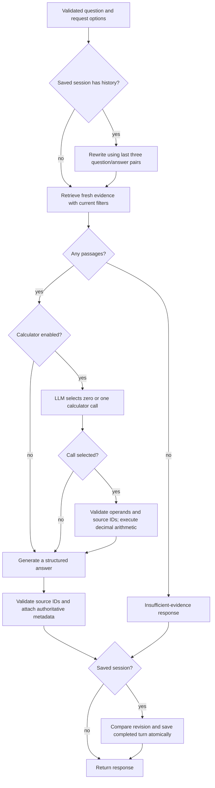

# Architecture and decisions

## Document lifecycle

`POST /documents/index` validates a single upload, extracts UTF-8 text or PDF page
text, and splits it into 1,000-character windows with 200-character overlap. Each
chunk retains its page (for PDFs), character offsets, and stable identifier.
SHA-256 of the uploaded bytes identifies a document; identical uploads replace
its chunks atomically and keep the latest uploaded filename. Raw files are not
retained. `/documents/ingest` is a preview that stops before embeddings/storage.

FastEmbed runs `BAAI/bge-small-en-v1.5` on CPU and returns 384-dimensional vectors.
Queries get the model's retrieval instruction; document passages do not. The
untruncated tokenizer enforces the 512-token input limit. Vector validation rejects
wrong dimensions, zero vectors, and non-finite values before SQL operations.

PostgreSQL stores metadata, extracted text, vectors, and completed chat turns.
This keeps source resolution and persistence in one transactional database.
pgvector performs exact cosine search. A schema/model/dimension record rejects an
incompatible index; changing embeddings requires a separate/rebuilt index.

Model preparation is explicit. The API loads the prepared cache with downloads
disabled; an empty/broken cache produces 503. The preparation CLI first verifies
an existing cache offline, then downloads only if it is missing/unusable.

## Answer and follow-up flow

Prior answers help interpret references such as “over three years”; they do not
become evidence. The rewrite uses at most three recent turns, with each historical
question capped at 500 characters and answer at 1,000. Current retrieval runs after
rewriting; old citations and tool state are not reused. The original question is
preserved in the saved/API response. Request filters and tool settings do not
silently carry over from earlier turns.

One ordinary question uses at most one LLM call. Enabling tools can add a selection
call; a follow-up with history can add a rewrite call. There are no automatic
provider retries or fallbacks. Empty retrieval skips generation entirely.

## Provider independence

`LLMProvider` describes generation, question rewriting, and optional tool selection.
The factory is the only place where settings choose Ollama, Hugging Face, or
OpenAI. Adapters own HTTP transport, structured-output envelopes, native tool
messages, refusal/truncation checks, and provider-specific continuation context.
The graph works with normalized domain objects instead of vendor responses.

Transport timeouts, unavailable providers, and invalid model output map to explicit
504, 503, and 502 responses. Raw upstream bodies/headers are not passed to clients.
Credentials stay in server settings. The same question/evidence contract is used
for local and remote models; changing the LLM does not change embeddings.

## Citation and calculator boundaries

The LLM supplies statements and source IDs, not authoritative filenames or paths.
The server resolves each source against the retrieved passages, rejects unknown
IDs and invalid answer shapes, and adds display markers and stored metadata.
Each answer has its own source-number namespace. The UI renders both answers
and passages as text; it never executes model/document markup.

The calculator accepts one of add/subtract/multiply/divide, constrained decimal
strings, and valid supporting source IDs. Arithmetic uses `Decimal`; there is no
`eval`, dynamic code, shell, or arbitrary function dispatch. Division by zero is
rejected. The final answer must cite the calculator's supporting sources.

These checks establish reference validity and deterministic arithmetic. They do
not prove semantic entailment, correct operand extraction, policy interpretation,
or that the generated prose matches every computed value. Such checks need
separate retrieval/answer evaluations.

## Persistence and concurrency

`conversations` holds UUIDs, titles, revision/turn counts, and timestamps.
`conversation_turns` stores completed structured response snapshots as JSONB,
including citations and calculator results. A foreign key cascades session
deletion to its turns. Titles are derived from the first completed question unless
renamed. Additive migrations backfill legacy titles/timestamps once and retain
existing turns and indexed documents.

History reads use one SQL snapshot for the revision and recent turns. The connection
closes before model calls. Saving conditionally updates the loaded revision and
inserts the new turn in one transaction. Conflicting requests return 409; failed
generation or insertion does not save a partial turn. A session deleted during
generation cannot be recreated by the later save.

LangGraph invocations have fresh transient state. This is application-level
conversation memory, not a LangGraph checkpoint/resume implementation. Provider
reasoning, transient tool messages, unsent drafts, and failed requests are not
persisted. History pagination uses `before_turn`; list pagination uses offsets.

## Runtime and HTTP boundaries

FastAPI owns validation and status mapping. Synchronous parsing, model inference,
and SQL run in worker threads. One cached embedding model serializes inference
per process; database connections are opened per operation with connection and
statement timeouts. The request middleware bounds the incoming body before
large content can reach the parser and tracks chunked bodies without trusting
Content-Length alone.

Request IDs are generated by the server and sent in `X-Request-ID`. JSON diagnostics
include method, route template, status, duration, and unexpected exception class.
They omit bodies, queries, headers, user text, exception messages, and credentials.
Validation responses omit rejected inputs; unexpected exceptions return a safe 500.
Uvicorn access logs are disabled in the container to avoid separately logging
query strings. Liveness checks avoid dependencies; readiness checks exercise
PostgreSQL schema compatibility and the cached embedding model without LLM calls.

The browser is packaged HTML/CSS/JavaScript served by the same app. DOM rendering,
API calls, and interaction state live in separate modules. Same-origin requests
avoid CORS configuration and keep provider credentials out of the browser.

## Scope and limitations

- Authentication, per-user ownership, and document/session authorization are not
  implemented. All documents and saved-session listings belong to a shared local
  workspace; a UUID is not an authorization boundary. Keep it on trusted machines.
- Text PDFs only; no OCR, table-aware parsing, isolated parser process, or document
  processing jobs. Character chunks can split sentences and occasionally exceed
  the tokenizer limit; those inputs return 422 rather than silent truncation.
- Exact retrieval is a small-corpus baseline. There is no reranker, HNSW index,
  measured retrieval-quality benchmark, or proof of answer entailment. Similarity
  scores are not confidence scores.
- No streaming, graph checkpoints, long-term summaries, connection pool, durable
  job queue, authentication-aware rate limiting, or distributed tracing backend.
  Request logging and readiness are operational foundations rather than a complete
  public-service deployment stack.
- A remote LLM receives the selected evidence and bounded conversation text.
  Account-specific availability, charges, retention, and policy remain provider
  concerns. Deleting an app session does not retract a previous hosted request.

These are explicit extension points for client-specific deployment requirements,
not hidden claims that the portfolio is ready for unauthenticated public hosting.
