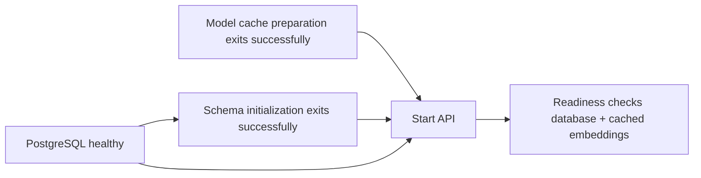

# Operations and troubleshooting

## Container lifecycle

```sh
# Preserve an existing .env. Copy .env.example only for first setup.
docker compose config --quiet
docker compose up --build -d --wait api
```

Targeting `api` activates the app profile. Plain `docker compose up -d postgres`
or `docker compose up -d` remains database-only, so host development continues to
work. To start the entire application profile explicitly, use
`docker compose --profile app up --build -d --wait`.

Startup order is:



Schema/model preparation are explicit one-shot jobs. A failed job prevents the API
from starting; it does not start a broken retrieval service or silently choose a
different provider. Their successful completion is coordinated with
[Compose dependency conditions](https://docs.docker.com/compose/how-tos/startup-order/).

The API runs as UID 10001, drops Linux capabilities, prevents privilege elevation,
and has a read-only root filesystem plus a temporary `/tmp`. The preparation job
writes the embedding volume; the API mounts it read-only. A digest-pinned Python
3.13 image, constrained application dependencies, installed package, and native
ONNX runtime library form the runtime image. BuildKit caches dependency installs
separately from code edits. The image build context is an allowlist; `.env`, Git
history, local caches, tests, and screenshots are not included.

Inspect only the relevant services:

```sh
docker compose ps -a
docker compose logs --tail=100 api db-init model-prepare
docker compose restart api
```

Restarting a container does not apply changed Compose environment values. After
editing `.env`, recreate the API:

```sh
docker compose up -d --force-recreate api
```

`docker compose --profile app down` stops/removes all application and database
containers and retains named volumes. **Adding `-v` deletes both stored data and
the embedding cache.** Do not use `-v` on development data to solve an ordinary
startup issue. Include the same `-f` override files used at startup in subsequent
Compose commands, including the CA override when your network requires it.

The development PostgreSQL volume name is preserved. Containers use
`postgres:5432`, not the host's `127.0.0.1:55432`. Updating `.env` credentials does
not change users/passwords in an already initialized PostgreSQL volume.

## Health, readiness, and diagnostics

```sh
curl -i http://127.0.0.1:8000/health
curl -i http://127.0.0.1:8000/ready
```

`/health` returns `{"status":"ok"}` without accessing PostgreSQL, embeddings, or an
LLM. `/ready` returns `{"status":"ready"}` only after checking schema/index
compatibility, required conversation/document columns, and cached embedding
inference. It returns 503 for unavailable local dependencies. It never calls a
remote LLM, downloads a model, or proves that the configured generation provider
is reachable/authorized. Test that separately with a known document/question.

The container healthcheck uses `/ready`. A missing cache or incompatible schema
makes the app unhealthy while the liveness endpoint can still respond. Health
status does not automatically repair data or change the selected provider.

Every HTTP response gets a new server-generated `X-Request-ID`. Unexpected errors
return a generic 500 with a support hint; validation errors keep `loc`, `msg`, and
`type` while excluding input/exception context. Known domain failures keep their
actionable status and detail. The browser displays request IDs with server errors.

Example request diagnostic:

```json
{"event":"http_request","request_id":"7c4124dc7d4842d2a52489baed3517bf","method":"POST","route":"/ask","status":200,"duration_ms":845.3}
```

Diagnostics omit questions, documents, raw paths/query strings, authorization
headers, credentials, and exception messages. Unexpected failures add the
exception class. Uvicorn access logs are disabled in the container and recommended
host command, since its normal access log can include a query string. Preserve
request IDs with reports rather than pasting private inputs or `.env` contents.

The request body limit is 5 MiB plus 64 KiB of multipart overhead, checked against
declared length and actual received chunks. The per-file parser still enforces
5 MiB, 100 pages, and 500,000 extracted characters. PDF null characters and known
malformed-parser errors map to 400 instead of reaching JSONB or leaking internals.

## Configuration

| Variable | Default / purpose |
| --- | --- |
| `LLM_PROVIDER` | `ollama`; alternatives `huggingface`, `openai` |
| `LLM_MODEL` | `qwen2.5:7b` for local default; required explicitly for remote providers |
| `HF_TOKEN`, `OPENAI_API_KEY` | Server-side credentials for the selected remote provider |
| `LLM_TIMEOUT_SECONDS` | 120 per provider request; greater than 0 and at most 600 |
| `LLM_MAX_OUTPUT_TOKENS` | 4096; 128–16384, including provider reasoning where applicable |
| `OLLAMA_BASE_URL` | Host Python: `http://127.0.0.1:11434` |
| `DOCKER_OLLAMA_BASE_URL` | Compose: `http://host.docker.internal:11434` |
| `MODEL_CACHE_DIR` | Host: `.cache/embeddings`; Compose fixes `/app/.cache/embeddings` |
| `DATABASE_URL` | Host PostgreSQL connection, matching the published database port |
| `DOCKER_DATABASE_URL` | Optional complete container URL; default uses `postgres:5432` and Compose credentials |
| `POSTGRES_USER`, `POSTGRES_PASSWORD`, `POSTGRES_DB` | Local development credentials/database |
| `POSTGRES_PORT` | Host loopback port 55432 |
| `API_PORT` | Host loopback API port 8000 |
| `TLS_CA_BUNDLE` | PEM trust bundle path, only with the optional CA Compose override |

Percent-encode special characters in URL credentials. Use `DOCKER_DATABASE_URL`
when the automatically composed development URL is not suitable. `.env.example`
contains shareable local defaults; real credentials belong only in ignored `.env`
or your deployment secret system. Tokens are runtime values, never image build args.
Container environment inspection and expanded `docker compose config` can reveal
runtime credentials; use `config --quiet` for validation.

The API and PostgreSQL ports bind to host loopback. On Linux, the host-gateway
mapping makes `host.docker.internal` resolve, but Ollama may also need a reachable
interface/configuration. Do not make an unauthenticated host model service broadly
reachable just to solve a Docker networking problem. You can instead configure
your intended private endpoint or use a supported remote provider.

## Import a prepared host cache

This project already supports preparing embeddings in the host `.venv`. If that
cache is complete, copy its public model files into the named Docker volume:

```sh
docker compose build api
docker compose run --rm --no-deps \
  -v "$PWD/.cache/embeddings:/seed:ro" model-prepare \
  python -c "import shutil; shutil.copytree('/seed', '/app/.cache/embeddings', dirs_exist_ok=True, symlinks=True)"
docker compose up -d --wait api
```

The source is read-only; the existing database is not touched. Model preparation
verifies a populated cache offline before attempting a download. Only use a cache
for the declared BGE model, with its metadata/tokenizer/weights intact. This solves
embedding-download availability; remote generation still needs valid TLS trust
and provider access.

## Networks with a private HTTPS CA

Host trust stores do not automatically become container trust stores. For an
enterprise HTTPS proxy/private CA, obtain the approved PEM CA bundle from your
environment administrator. It should include normal public roots and the required
private CA. Keep it outside Git, and mount it through the override:

```sh
TLS_CA_BUNDLE=/absolute/path/to/trusted-ca-bundle.pem \
  docker compose -f compose.yaml -f compose.ca.yaml up --build -d --wait api
```

The override grants the bundle only to model preparation and the API at runtime
and sets `SSL_CERT_FILE`. It is not copied into the image. The Python TLS context
continues to verify certificates/hostnames. Do not set verification off or trust
an arbitrary certificate copied from an unverified connection. Use the same file
arguments when operating containers created with the override. Build-time registry
and pip trust are separate concerns handled by your Docker/build environment.

## Common errors

| Status / symptom | Check / next action |
| --- | --- |
| 400 upload | UTF-8 text, valid text PDF, no encryption/null characters, valid filename |
| 413 | File/request/page/extracted-text limit; split or shorten the document |
| 415 | Upload `.txt` or `.pdf` |
| 422 embedding input | Shorten a query/passage that exceeds 512 tokens; no silent truncation |
| 404 session | Reload the directory; the session may have been deleted elsewhere |
| 409 session | Reload current history before retrying; the failed generation may already have incurred usage |
| 502 | Model output/refusal/truncation/tool/source protocol failed validation; inspect configuration and request ID |
| 503 | Check model cache, database/schema, provider credentials/model identifier/service |
| 504 | Selected generation provider timed out; check reachability/model capacity and output budget |
| 500 | Report the request ID; logs contain safe exception class and route rather than private content |
| Model-preparation exit 1 | Check network trust, cache permissions, approved CA bundle, or import a complete host cache |
| Port already in use | Stop the overlapping API or set `API_PORT`/host `--port`; leave unrelated containers alone |

If a connection breaks after `/ask`, the browser may not know whether the turn was
saved. Reload history before retrying. There are no automatic inference retries
or guarantees that retrying a network-interrupted request is cost-free/idempotent.

## Before public/client deployment

This repository is a trusted local shared workspace. A client deployment needs
explicit identity/authorization, document/session ownership, trusted TLS, secrets
and backup management, provider data-policy review, and workload-specific capacity
controls. Parser isolation, jobs/pooling, evaluation, and any required rate limits
are listed in [the architectural scope](architecture.md#scope-and-limitations).
The Docker image and test suite are deployment foundations, not a claim that
unauthenticated public exposure is appropriate.
